* Table of Contents
{:toc}

---

## 1. **Acknowledgements**

SudoHR is a brownfield software project based off [AddressBook Level-3](https://se-education.org/addressbook-level3/), created under the module CS2103 for the School
of Computing in the National University of Singapore

Java dependencies:

* Jackson for JSON data storage
* JavaFX for our GUI
* JUnit5 for testing

Documentation dependencies:

* Jekyll
* PlantUML for creating UML diagrams

---

## 2. **Setting up, getting started**

Refer to the guide [_Setting up and getting started_](SettingUp.md).

---

## 3. **Design**

:bulb: **Tip:** The `.puml` files used to create diagrams in this document can be found in the [diagrams](https://github.com/se-edu/addressBook-level3/tree/master/docs/diagrams/) folder. Refer to the [_PlantUML Tutorial_ at se-edu/guides](https://se-education.org/guides/tutorials/plantUml.html) to learn how to create and edit diagrams.

### 3.1. Architecture

The \* \* _Architecture Diagram_ \* \* given above explains the high-level design of the App.

Given below is a quick overview of main components and how they interact with each other.

**Main components of the architecture**

**`Main`** has two classes called [`Main`](https://github.com/se-edu/addressBook-level3/tree/master/src/main/java/seedu/address/Main.java) and [`MainApp`](https://github.com/se-edu/addressBook-level3/tree/master/src/main/java/seedu/address/MainApp.java). It is responsible for,

- At app launch: Initializes the components in the correct sequence, and connects them up with each other.
- At shut down: Shuts down the components and invokes cleanup methods where necessary.

[**`Commons`**](#common-classes) represents a collection of classes used by multiple other components.

The rest of the App consists of four components.

- [**`UI`**](#ui-component): The UI of the App.
- [**`Logic`**](#logic-component): The command executor.
- [**`Model`**](#model-component): Holds the data of the App in memory.
- [**`Storage`**](#storage-component): Reads data from, and writes data to, the hard disk.

**How the architecture components interact with each other**

The _Sequence Diagram_ below shows how the components interact with each other for the scenario where the user issues the command `delete 1`.

Each of the four main components (also shown in the diagram above),

- defines its _API_ in an `interface` with the same name as the Component.
- implements its functionality using a concrete `{Component Name}Manager` class (which follows the corresponding API `interface` mentioned in the previous point.

For example, the `Logic` component defines its API in the `Logic.java` interface and implements its functionality using the `LogicManager.java` class which follows the `Logic` interface. Other components interact with a given component through its interface rather than the concrete class (reason: to prevent outside component's being coupled to the implementation of a component), as illustrated in the (partial) class diagram below.

The sections below give more details of each component.

### 3.2. UI component

The **API** of this component is specified in [`Ui.java`](https://github.com/se-edu/addressBook-level3/tree/master/src/main/java/seedu/address/ui/Ui.java)

The UI consists of a `MainWindow` that is made up of parts e.g.`CommandBox`, `ResultDisplay`, `EmployeeListPanel`, 
`DepartmentListPanel`, `LeaveListPanel`, `StatusBarFooter` etc. All these, including the `MainWindow`, inherit from 
the abstract `UiPart` class which captures the commonalities between classes that represent parts of the visible GUI.

The `UI` component uses the JavaFx UI framework. The layout of these UI parts are defined in matching `.fxml` files that are in the `src/main/resources/view` folder. For example, the layout of the [`MainWindow`](https://github.com/se-edu/addressBook-level3/tree/master/src/main/java/seedu/address/ui/MainWindow.java) is specified in [`MainWindow.fxml`](https://github.com/se-edu/addressBook-level3/tree/master/src/main/resources/view/MainWindow.fxml)

As the `Logic` component executes user commands, the `UI` component,

- listens for changes to `Model` data so that the UI can be updated with the modified data.
- keeps a reference to the `Logic` component, because the `UI` relies on the `Logic` to execute commands.
- relies on stored data in the `Model` component, as it displays `Employee`, `Department` or `Leave` object residing 
  in the `Model`.

### 3.3. Logic component

**API** : [`Logic.java`](./images/LogicClassDiagram.png)

Here's a (partial) class diagram of the `Logic` component:

How the `Logic` component works:

1. When `Logic` is called upon to execute a command, it uses the `SudoHRParser` class to parse the user command.
1. This results in a `Command` object (more precisely, an object of one of its subclasses e.g., `AddCommand`) which is executed by the `LogicManager`.
1. The command can communicate with the `Model` when it is executed (e.g. to add an employee).
1. The result of the command execution is encapsulated as a `CommandResult` object which is returned back from `Logic`.

The Sequence Diagram below illustrates the interactions within the `Logic` component for the `execute("delete 1")` API call.

:information_source: **Note:** The lifeline for `DeleteCommandParser` should end at the destroy marker (X) but due to a limitation of PlantUML, the lifeline reaches the end of diagram.

Here are the other classes in `Logic` (omitted from the class diagram above) that are used for parsing a user command:

How the parsing works:

- When called upon to parse a user command, the `SudoHRParser` class creates an `XYZCommandParser` (`XYZ` is a placeholder for the specific command name e.g., `AddCommandParser`) which uses the other classes shown above to parse the user command and create a `XYZCommand` object (e.g., `AddCommand`) which the `SudoHRParser` returns back as a `Command` object.
- All `XYZCommandParser` classes (e.g., `AddCommandParser`, `DeleteCommandParser`, ...) inherit from the `Parser` interface so that they can be treated similarly where possible e.g, during testing.

### 3.4. Model component

**API** : [`Model.java`](./images/ModelClassDiagram.png)

The `Model` component,

- stores the system data i.e., all `Employee`, `Department` and `Leave` objects (which are contained in `UniqueEmployeeList`, `UniqueDepartmentList` and `UniqueLeaveList` objects respectively).
- stores the currently 'selected' `Employee`, `Department` and `Leave` objects (e.g., results of a search query) as a separate _filtered_ list which is exposed to outsiders as an unmodifiable `ObservableList<Employee>`, `ObservableList<Department>` or `ObservableList<Leave>`, that can be 'observed' e.g. the UI can be bound to this list so that the UI automatically updates when the data in the list change.
- stores a `UserPref` object that represents the user’s preferences. This is exposed to the outside as a `ReadOnlyUserPref` objects.
- does not depend on any of the other three components (as the `Model` represents data entities of the domain, they should make sense on their own without depending on other components)

### 3.5. Storage component

**API** : [`Storage.java`](./images/StorageClassDiagram.png)

The `Storage` component,

- can save both SudoHR data and user preference data in json format, and read them back into corresponding objects.
- inherits from both `SudoHRStorage` and `UserPrefStorage`, which means it can be treated as either one (if only the functionality of only one is needed).
- depends on some classes in the `Model` component (because the `Storage` component's job is to save/retrieve objects that belong to the `Model`)

### 3.6. Common classes

Classes used by multiple components are in the `seedu.SudoHR.commons` package.

---

## 4. **Design & Implementation**
This section describes some noteworthy details, alongside considerations and constraints, on how certain features or classes are implemented.

### 4.1. Design considerations:

#### 4.1.1. Employee
An important design consideration to note for Employee is the multiple different fields that qualify as candidate _keys_, such as an employee id, email address, and phone number.

These are fields to guard against duplication. An employee's id is any uniquely generated identifier assigned to it by the company upon joining. Two employees should not share email field or phone number as those two fields are understood to be unique.

Since any employee can be identified by its id, and it makes semantic sense, we have decided on the id field as the _Primary Key_. This field can be used by internal operations without any concern of duplicates and allow us to easily retrieve and display the unique employee with the given id.

Under this design, SudoHR supports having several employees with the same name fields, without running the risk of retrieving or using the wrong employee's data.

##### Cascading employee updates and deletion to department and leave
An important functionality is to ensure updates to employee is cascaded down to department-level and leave-level because
each department and leave has its own list of employees. This issue becomes more prominent during loading of storage files
where employee objects are separately created for department's and leave's employee lists.
Hence, any editing of an employee's fields after SudoHR is initialized from storage needs to be cascaded down to leaves and departments to modify the equivalent employee object.

Further, we need to ensure the UI correctly refreshes for any changes made to an employee.
For instance, if an employee has been deleted, he/she should be removed from their department and the department count should drop. The same can be said for leaves.
This consistency is crucial to avoid confusing the user, especially since several of our commands are intertwined.

#### 4.1.2. Departments

An important design consideration for Department is that it must not contain duplicate employees. This is to ensure simplicity and
clarity when adding and removing employees from a department, as well as for the cascading process.

Each department is uniquely identified by its name, as a department should not share the same name with another department.

In the future, it would be possible to add more fields to a department, such as manager, parent department, etc.

#### 4.1.3. Leaves

An important design consideration for Leave is that it must not contain duplicate employees. This is to ensure simplicity and
clarity when adding and removing employees from a Leave object, as well as for the cascading process.

Each leave is uniquely identified by its LeaveDate which represent the date on which the leave is on and tracks all
the employees that have taken leave on that specific day. We tracked all the leaves using the UniqueLeaveList which
follows a similar implementation as UniqueEmployeeList except that it enforces the constraints that each Leave's
LeaveDate must be unique.

In the future, it would be possible to modify SudoHR to track different types of leaves
(eg. Medical) by adding a new type field to the Leave class.

### 4.2. Employee-related features

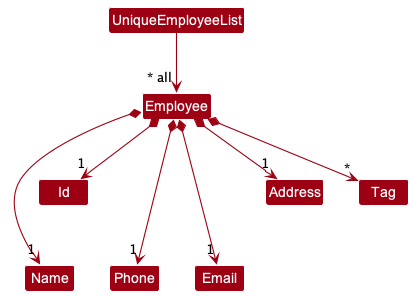

The 'Employee' object represents an Employee in the company. They are all stored in a `UniqueEmployeeList`.

The attributes of an Employee are:
- `Id`: The employee id, which is their unique identifier in the company.
- `Name`: The name of the employee.
- `Email`: The email of the employee, which should be unique.
- `Phone`: The phone of the employee, which should be unique.
- `Address`: The address of the employee.
- `Tags`: The tags assigned to the employee.

**Note**:
1. For the commands in this section, the order in which the prefixes (if any) are placed does not matter.
   1. `edit eid/37 a/ntu p/8461 4872` will invoke the same result as `edit eid/37 p/8461 4872 a/ntu`
2. If duplicated prefixes are provided, only the argument associated with last instance of the same prefix will be processed by the parser.
3. We make a distinction between the prefixes `id/` and `eid/`. The former is used in commands during adding of an employee or editing of an employee’s Id field whereas the latter is used in commands that references an employee that exists in SudoHR.

#### 4.2.1 Adding an employee

The `add` command adds a new employee, with the specified fields, into SudoHR. Note that only the 'Tag' field is optional.

Activity Diagram:
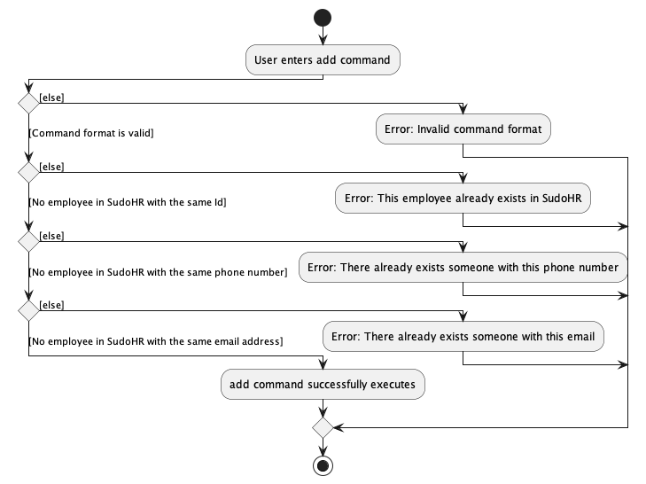

Sequence Diagram:
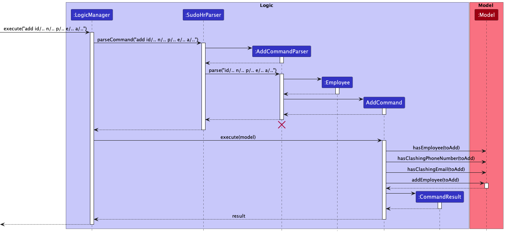

##### Flow
1. The user enters the command, eg. `add id/37 n/John p/9861 7251 e/John@nus.com a/nus t/Vegetarian`
2. The parser will parse the argument and instantiates several fields: Id, name, phone, email, address, and tags, respectively with the prefixes.
3. An `Employee` object is constructed and handed over to the `AddCommand`.
4. The command is executed. It first checks if there exists an employee with the same Id field as specified, followed by phone number, and lastly email address.
5. If none of the fields are duplicated, the model adds the employee to SudoHR.

After that, the command result is returned.

##### Feature considerations
When checking for duplicated fields across employees, the `Id`, `Phone`, and `Email` fields are checked.
This is because `Id` is meant to be the unique identifier for an employee and `Phone` and `Email` fields are understood
to be unique fields as well.

The Id field is an integer. To avoid ambiguity in interpretation and possible confusion in identifying an employee, we have decided to ignore preceding zeros. 
For instance, `0007` and `7` are treated as one and the same.

#### 4.2.2 Editing an employee

The `edit` command edits the fields of an existing employee in SudoHR. 
Note that it is mandatory to specify the Id of the employee to be edited and at least one of the fields must be changed.

Activity Diagram:
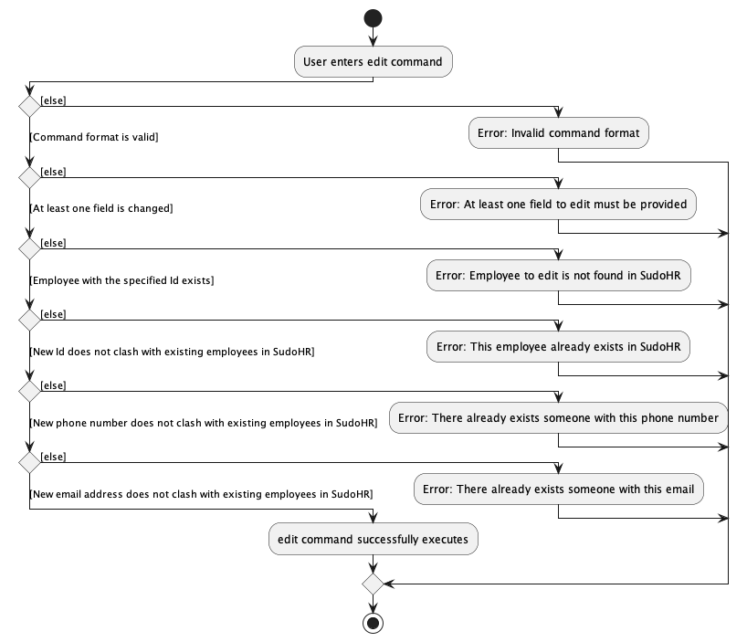

Sequence Diagram:
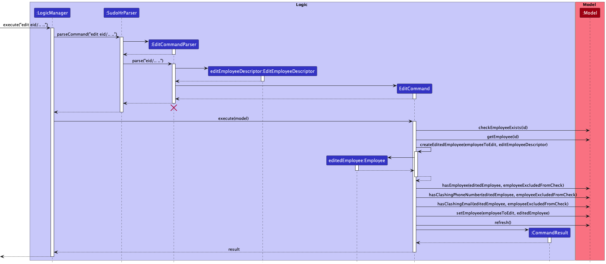

##### Flow
1. The user enters the command, eg. `edit eid/37 p/8461 4872 a/ntu`. The employee with Id 37 will be identified and will have its phone and address fields updated as specified, if it exists in SudoHR.
2. The parser will instantiate a new `Phone` and `Address` object constructed from the arguments associated with `/p` and `/n`, which represents the new phone number and address fields respectively.
3. A `EditEmployeeDescriptor` object is constructed with the updated fields and alongside the employee's Id, are handed over to `EditCommand`.
4. The command is executed. It first verifies that there is an employee with Id 37. 
5. If such an employee exists, the command will then check if any of the 3 identities fields - Id, phone number, and email - have duplicated instances between the proposed changes and employees in SudoHR.
   The non-edited attributes of the employee will remain unaffected and inherited by the `EditEmployeeDescriptor`
6. If uniqueness in the 3 identities fields can be maintained, the old employee instance will be replaced with the new employee instance created by `EditEmployeeDescriptor`.

After that, the command result is returned.

##### Feature considerations
The `EditEmployeeDescriptor` is used to store the details to be edited. This abstraction is used as not all fields
may be edited for the `EditCommand`. So, this class ensures that fields are not edited will be unaffected and correctly initialized for the new edited employee. 
This modularity in design will prove useful in the future if more employee-level details are added, as per the open-closed principle.

It is important to check and guard against duplication of Id, email, and phone fields during editing of an employee's fields.

While Id is the unique identifier of an employee, there should also be the flexibility of editing Id field without causing any subsequent inconsistency when referencing an employee.

#### 4.2.3 Deleting an employee
The `del` command deletes an existing employee from SudoHR.

Activity Diagram:
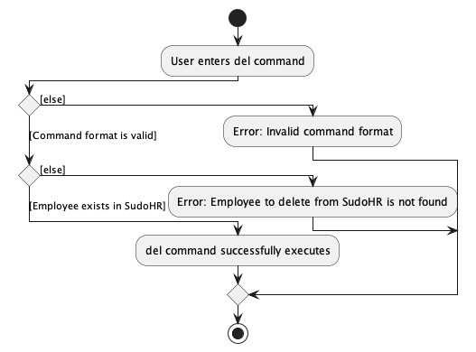

Sequence Diagram:

##### Flow
1. The user enters the command, eg. `del eid/37` where employee with Id 37 is to be removed from SudoHR.
2. The parser will instantiate the corresponding `Id` object constructed from the argument associated with the prefix `eid/`.
3. The command is executed. It first verifies that an employee with the specified Id exists.
4. If the employee exists, it is deleted from SudoHR.

After that, the command result is returned.

#### Feature considerations
We need to ensure that if an employee is deleted, it is also removed from being tracked by other entities such as `Department` and `Leave`. More details are explained [here](https://github.com/AY2223S2-CS2103T-T17-2/tp/blob/master/docs/DeveloperGuide.md#cascading-employee-updates-and-deletion-to-department-and-leave).

#### 4.2.4 Listing all employees
The `list` command lists all the employees in SudoHR.

The call stack is the same as a typical command except that it has no specified parser. 
Instead, `SudoHrParser` directly returns the command containing the predicate `PREDICATE_SHOW_ALL_EMPLOYEES` specified in the `Model` class.

Upon execution, it updates the `filteredEmployeeList` in SudoHR.

After that, the command result is returned.

#### 4.2.5 Finding an employee by ID
The `feid` command finds and displays an employee with the specified Id in SudoHR.

#### Flow
1. The user enters the command, eg. `feid eid/37` where employee with Id 37 is to be found.
2. The parser will instantiate the corresponding `Id` object constructed from the argument associated with the prefix `eid/`.
3. A predicate checking for the specified Id is instantiated and the command is executed with the predicate.
4. It first verifies that an employee with the specified Id exists.
5. If the employee exists, the `filteredEmployeeList` is updated to only contain the employee with Id of 37 and the UI will display only the employee.

#### 4.2.6 Finding an employee by keyword
The `find` command finds and displays all employees in SudoHR with some part of their names matching the specified keyword.

#### Flow
1. The user enters the command, eg. `find alex` to look for employees whose name contains 'alex'.
2. The parser will instantiate a predicate that looks for the specified keyword, constructed from the argument provided, in employee's name field.
3. The command is executed with the predicate and the `filteredEmployeeList` is updated to contain all of such employees, with the UI displaying the employees to the user.

### 4.3. Department-related features

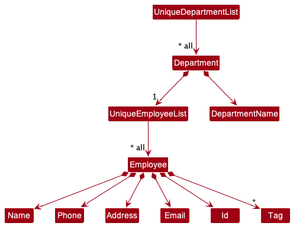

The `Department` object represents a department in the company. They are all stored in a `UniqueDepartmentList` managed by SudoHR.

The attributes of a department are:

- `DepartmentName`: The name of the department, which is also the unique identifier for a department.
- `UniqueEmployeeList`: The employees in a department, the list must not contain duplicate employees.

The uniqueness of each department in `UniqueDepartmentList` is enforced by checking against the `DepartmentName`. This will be explained in the _Adding a department_ section.

#### 4.3.1. Adding a department

The `adep` command adds a new `Department` in SudoHr.

Activity Diagram:

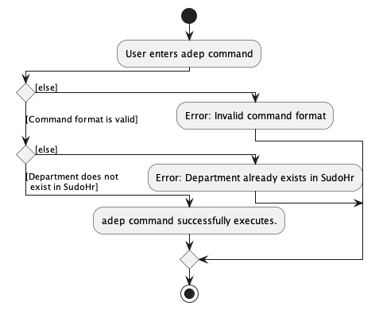

Sequence Diagram:

##### Flow

1. The user enters the command, eg. `adep n/Sales`
2. The parser will instantiate a new `DepartmentName` object constructed from the input of the argument `/n` which represents the department name.
3. A `Department` object is constructed from the `DepartmentName` and handed over to the `AddDepartmentCommand`.
4. The command is executed. It first checks if the department contains the employee being added. This is done to prevent the addition of duplicate
   employees in the same department.
5. If there is no duplicate, the model adds the department to SudoHR.

After that, the command result is returned.

##### Feature considerations

When checking for duplicates in the `UniqueDepartmentList`, the `DepartmentName` of the department is used to uniquely
identify each department. This is because it is illogical to have 2 departments with the same name, as the application
is meant for use by a single company.

If duplicate arguments are present in the same command, the last instance of the duplicated argument is taken in by the parser.

#### 4.3.2. Editing a department

The `edep` command edits the department-level details of an existing `Department` in SudoHr. Currently, you can only
edit the department name field as it is the only existing department-level detail.

Activity Diagram:

Sequence Diagram:

##### Flow

1. The user enters the command, eg. `edep Marketing n/Sales`. Marketing is the new department name and Sales is the old department name.
2. The parser will instantiate a new `DepartmentName` object constructed from the input of the argument `/n` which represents the new department name.
3. A `EditDepartmentDescriptor` object is constructed from the `DepartmentName` and handed over to the `EditDepartmentCommand`.
4. The command is executed. It first tries to find the department called Marketing.
5. If the Marketing department exists, the command will then create the new department called Sales using the EditDepartmentDescriptor.
   The non-edited attributes from Marketing will be passed down to Sales.
6. The command then checks if the edited department exists in SudoHR.
7. If there is no duplicate, the model adds the department to SudoHR.

After that, the command result is returned.

##### Feature considerations

The `EditDepartmentDescriptor` is used to store the details to be edited. This abstraction is used as not all fields
may be edited for the `EditDepartmentCommand`, hence we use this class to figure out what to pass down during the
construction of the new edited department. As of now, this class may be trivial but will prove more useful in the future
when more department-level details are added (e.g. creation date, director, work type, etc.).

It is also important to check if the name of the newly edited department clashes with any existing departments in
SudoHR, as the name is the unique identifier for a department.

#### 4.3.3. Deleting a department

The `deldep` command deletes an existing `Department` in SudoHR.

Activity Diagram:

Sequence Diagram:

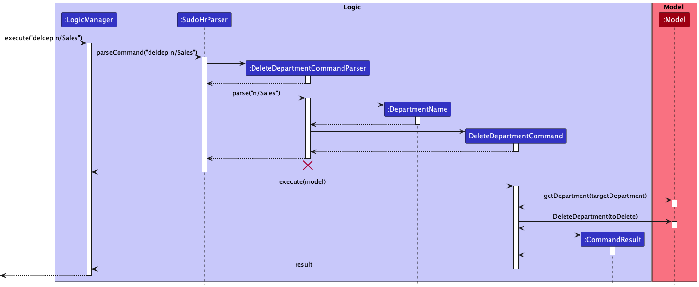

##### Flow

1. The user enters the command, eg. `deldep n/Sales`. Sales is the department to be deleted.
2. The parser will instantiate a new `DepartmentName` object constructed from the input of the argument `/n` which represents the new department name.
3. The `DepartmentName` is passed down to the command.
4. The command is executed. It first tries to find the department called Sales.
5. If the Sales department exists, it will be deleted from SudoHR.

After that, the command result is returned.

[//]: # (#### 4.3.4. Listing all departments)

[//]: # ()
[//]: # (The `listdep` command lists all the departments in SudoHR.)

[//]: # ()
[//]: # (![ListDepartmentCommand]&#40;./images/commands/department/ListDepartmentSequenceDiagram.png&#41;)

[//]: # ()
[//]: # (The call stack is the same as a typical command except that it has no specified parser. Instead, `SudoHrParser` directly returns the command containing the required predicate.)

[//]: # ()
[//]: # (Upon execution, it updates the `filteredDepartmentList` in SudoHR.)

[//]: # ()
[//]: # (After that, the command result is returned.)

#### 4.3.4. Adding an employee to a department

The `aetd` command adds an existing `Employee` to an existing `Department` in SudoHR.

Activity Diagram:

Sequence Diagram:

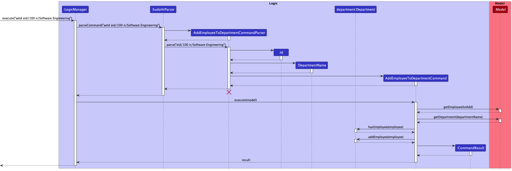

##### Flow

1. The user enters the command, eg. `aetd eid/100 n/Software Engineering`. It represents that the employee with ID 100
   is supposed to be added to the Software Engineering department.
2. The parser instantiates a new `Id` and `DepartmentName` object constructed from the input of arguments `eid/` and `n/` respectively.
3. The command is executed. It first tries to find the employee with ID 100 and department called Software Engineering.
4. If the employee and department exists, the command checks if the same employee exists in the department.
5. If there is no duplicate employee in the department, the model adds the employee to the department.

After that, the command result is returned.

##### Feature considerations

There was a major design decision, which is to use `UniqueEmployeeList` for the employee list inside a `Department`.
The idea is that a department should not contain duplicate employees. Hence, we made use of the existing
`UniqueEmployeeList` class in `SudoHr`, instead of creating a new employee list class for Department. This logic is
reused in `Leaves` as well.

It should be noted that we still used defensive checks such as `department.hasEmployee` despite the
`UniqueEmployeeList` having such checks internally already.

#### 4.3.5. Removing an employee from a department

The `refd` command removes an `Employee` from an existing `Department` in SudoHR.

Activity Diagram:

Sequence Diagram:

##### Flow

1. The user enters the command, eg. `refd eid/100 n/Software Engineering`. It represents that the employee with ID 100
   is supposed to be removed from the Software Engineering department.
2. The parser instantiates a new `Id` and `DepartmentName` object constructed from the input of arguments `eid/` and `n/` respectively.
3. The command is executed. It first tries to find the employee with ID 100 and department called Software Engineering.
4. If the employee and department exists, the command checks if the same employee exists in the department.
5. If the employee exists in the department, the model removes the employee from the department.

After that, the command result is returned.

#### 4.3.6. Listing an employee's departments

The `led` command

Activity Diagram:

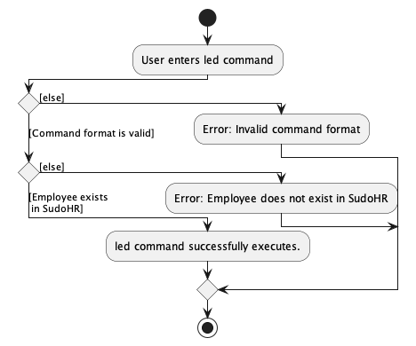

Sequence Diagram:

##### Flow

1. The user enters the command, eg. `led eid/100`. It represents listing all departments that contain employee
   with ID 100.
2. The parser instantiates a new `Id` object constructed from the input of argument `eid/`.
3. The `Id` object is used to instantiate the `DepartmentContainsEmployeePredicate`, which will be used to filter
   the `FilteredDepartmentList` later on.
4. The command is executed. It first tries to find the employee with ID 100.
5. If the employee exists, the `FilteredDepartmentList` will be updated and SudoHR will display all the departments
   that employee with ID 100 is in.

After that, the command result is returned.

### 4.4. Leave-related features
The `Leave` object represents a leave date in the company. They are all stored in a `UniqueLeaveList`.

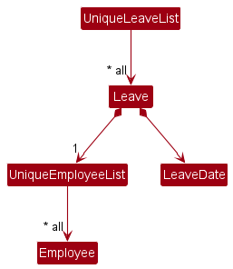

The attributes of a leave are:

- `LeaveDate`: The date of the leave, which is also the unique identifier for a leave
- `UniqueEmployeeList` : The employees who applied for this leave, the list must not contain duplicate employees. 

#### 4.4.1. Adding an employee's leave
The `aetl` command adds an employee's leave on a specific day:

Activity Diagram:

Sequence Diagram:

##### Flow

1. The user enters the command `aetl eid/1 d/2022-03-04` where 1 is the employee id and 2022-03-04 is the leave date.
2. The parser instantiates a new `Id` and `LeaveDate` object constructed from the input of argument `eid/` and `d/` respectively
3. The `Id` and `LeaveDate` are passed down to the command.
4. The command is executed. It first tries to find the `Employee` with ID 1 and the `Leave` that represents the date on which the leave is taken. If the `Leave` does not exist, a new one is created and added to `SudoHR`. If the `Employee` does not exist, an error message will be displayed.
5. If the employee already exists in `Leave`, an error message will be displayed.
6. Assuming if Step 5 completes without exception, the employee would be added to the `Leave`.
7. `FilteredEmployeeList` will be updated to only display all employees having leave on the input date.
8. `FilteredLeaveList` will be updated to only display the leave on the added date.

##### Feature considerations

We decided to throw an exception when the employee has already taken leave on the same day as the input date, since the user may have accidently provided a wrong date and hence the exception would be more suitable as it would be more noticeable than the success message.

#### 4.4.2. Deleting an employee's leave
The `defl` command delete an employee's leave on a specific day:

Activity Diagram:

Sequence Diagram:

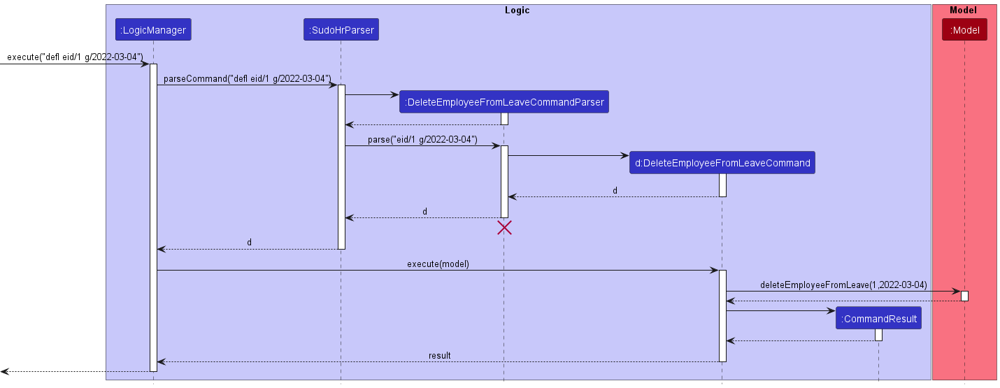

##### Flow

1. The user types and enters the command `defl eid/1 d/2022-03-04` where 1 is the employee id and 2022-03-04 is the leave date.
2. The parser would instantiate a new `Id` and `LeaveDate` constructed from the input of argument `eid/` and `d/` respectively
3. The `Id` and `LeaveDate` are passed down to the newly created command.
4. The command is executed. It first tries to find the `Employee` with ID 1 and the `Leave` that represents the date on which the leave is taken. If the `Employee` does not exist, an error message will be displayed.
5. If the employee does not exists in `Leave` (The employee has yet take leave on the input date), an error will be thrown too.
6. Assuming if Step 5 completes without exception, the employee would be added to the `Leave`.
7. `FilteredEmployeeList` will be updated to only display all employees having leave on the input date.
8. `FilteredLeaveList` will be updated to only display the leave on the delete date.

#### 4.4.3. Adding an employee's leave in a range
The `aelr` command adds an employee's leave on all the days between the range of a start date to an end date inclusive.

Activity Diagram:

Sequence Diagram:

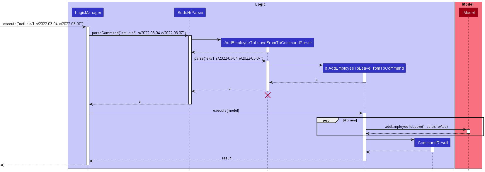

##### Flow

1. The user types and enters the command `aelr eid/1 s/2022-03-04 e/2022-03-06` where 1 is the employee id, 2022-03-04 is the start date and 2022-03-06 is the end date.
2. The parser checks that the end date `e/` is not before the start date represented by `s/`.The end date `e/` also must be less than 7 days away from the start date `s/`. If both conditions are not satisfied, an error message will be shown.
3. The parser would instantiate a `Id` constructed from the input of argument `eid/` and a list of `LeaveDate` objects representing every single day in the range between `s/` and `e/` with the end and start dates inclusive.
4. The `Id` and list of `LeaveDate` are passed down to the newly created command.
5. The command is executed. The command first tries to find the `Employee` with ID 1. If the `Employee` does not exist, an error message will be displayed.
6. The command then checks if the employee has taken leave on any of the days in the range between the start date `s/` and end date `e/` inclusive. If this is the case, an error message would be thrown.
7. Assuming step 6 completes with no exception, `Employee` is added to `Leave` on all the days in the range of the start day to end date inclusive
8. `FilteredLeaveList` will be updated to show all the days on which the employee has successfully taken leave.

##### Feature considerations
We intentionally limited the range of days to be added to 1 week. This is to avoid excessively large ranges that are likely to be an error or typo rather than intended, such as taking leaves over multiple years. Hence, we decided that 1 week would be the most appropriate duration as it is the typical length of leave taken when people go on vacation.

Should an employee indeed have more than 1 week of leave applied, the leave will be registered as different commands.

We also decided to guard against adding the range of leaves dates if even one of the days have already been indicated as leave. This is to be consistent with AddEmployeeToLeave command. In the case that the user would actually like to extend the leave for an employee, the addition would only require two additional commands and hence, is likely of minimal inconvenience to the user.

#### 4.4.4. Listing all employees taking leave on a specific day

The `leol` command lists employees taking leave on a specific date.

##### Flow 
1. The user types and enters the command `leol 2022-04-02` where 2022-04-02 is the date input provided.
2. The parser would instantiate a `LeaveDate` object constructed from the input argument.
3. The command is executed. It instantiates a new `LeaveContainsEmployeePredicate` that will filter out employees that have not taken leaves on the specified date.
4. The command uses the `LeaveContainsEmployeePredicate` to filter the employees and display the employees that have taken leave on the specified day.

#### 4.4.5. Listing all leaves 
The `llve` command lists all leaves taken by employees in SudoHR.

The call stack is the same as a typical command except that it has no specified parser.
Instead, `SudoHrParser` directly returns the command containing the predicate `PREDICATE_SHOW_ALL_NON_EMPTY_LEAVES` specified in the `Model` class.

Upon execution, it updates the `filteredLeaveList` in SudoHR.

After that, the command result is returned.

##### Feature considerations
Only leaves that have at least 1 employee will be displayed.

---

## 5. **Documentation, logging, testing, configuration, dev-ops**

- [Documentation guide](Documentation.md)
- [Testing guide](Testing.md)
- [Logging guide](Logging.md)
- [Configuration guide](Configuration.md)
- [DevOps guide](DevOps.md)

---

## 6. **Appendix: Requirements**

### 6.1. Product scope

**Target user profile**: HR in company who has a need to manage a significant number of employees

**Value proposition**: data management for employees faster than a typical mouse/GUI driven app

### 6.2. User stories

Priorities: High (must have) - `* * *`, Medium (nice to have) - `* *`, Low (unlikely to have) - `*`

| Priority | As a …​      | I want to …​                                                   | So that I can…​                                                            |
| -------- | ------------ | -------------------------------------------------------------- | -------------------------------------------------------------------------- |
| `* * *`  | new user     | see usage instructions                                         | refer to instructions when I forget how to use the App                     |
| `* * *`  | HR personnel | add a new employee                                             | keep track of the personal details of a newly hired employee             |
| `* * *`  | HR personnel | edit a new employee                                            | update an employee's personal details when it has changed       |
| `* * *`  | HR personnel | delete an employee                                             | stop tracking the personal details of an employee that has left the company      |
| `* *`  | HR personnel | find an employee by name                                       | locate details of an employee without having to go through the entire list   |
| `* `    | HR personnel | hide private contact details                                   | minimize chance of someone else seeing them by accident                    |
| `* * *`  | HR personnel | add an employee’s leave to SudoHR                              | keep track of when an employee is on leave                                        |
| `* * *`  | HR personnel | remove an employee’s leave from SudoHR                          | stop tracking the leave of an employee that is wrongly added                                        |
| `* * *`  | HR personnel | view all leaves an employee has applied for                    | determine when an employee will no be present in the company                                   |
| `* `  | HR personnel | view all employees on leave today                              | know the number of employees absent today                                                     |
| `* * *`  | HR personnel | view all employees on leave for a given day                        | know which employees that will be absent from the company on a specific day                                                 |
| `* * `  | HR personnel | view all employees on leave for a given day for a given department | know which employees are absent from a department on a specific day                                              |
| `* * *`  | HR personnel | add a department                                               | keep track of the details of a department and the employees inside        |
| `* * *`  | HR personnel | edit a department                                              | update the details of a department if it is incorrect  |
| `* * *`  | HR personnel | delete a department                                            | stop tracking the details of a department that is disbanded         |
| `* * `  | HR personnel | find a department by name                                      | locate details of departments without having to go through the entire list |
| `* * *`  | HR personnel | add an employee to a department                                | keep track of which employees are part of a department   |
| `* * *`  | HR personnel | remove an employee from a department                           | keep track that an employee no longer belongs to a department   |
| `* * *`  | HR personnel | list all departments an employee is in                         |                                                                            |
| `* * *`  | HR personnel | list all employees in a department                             | view manpower size of a department
| `* *`    | HR presonnel | list all employees that are present in the company for a department on a specific day | know who will be avaliable to contact in a department on a specific day  |

_{More to be added}_

### 6.3. Use cases

(For all use cases below, the **System** is `SudoHR` and the **Actor** is the `user`, unless specified otherwise)

**Use case: UC1 - Adding a employee**

**MSS:**

1.  User requests to add a new employee to SudoHR.
2.  SudoHR adds the employee.

    Use case ends.

**Extensions**

* 1a. There is already an employee in SudoHR with the same eid, phone number or email as the new employee added.

    * 1a1. SudoHR shows an error message.

      Use case resumes at step 1.

* 1b. The given command has invalid inputs.

    * 1b1. SudoHR shows an error message.

      Use case resumes at step 1.

**Use case: UC2 - Delete a employee**

**MSS:**

1.  User requests to delete a specific employee with a specific eid.
2.  SudoHR deletes the employee.

    Use case ends.

**Extensions**

* 1a. There is no employee with the eid given as input.

    * 1a1. SudoHR shows an error message.

      Use case resumes at step 1

* 1b. The given command has invalid inputs.

    * 1b1. SudoHR shows an error message.

      Use case resumes at step 1.

**Use case: UC3 - Edit a employee**

**MSS:**

1.  User requests to edit a specific employee with a specific eid.
2.  SudoHR edits the employee.

    Use case ends.

**Extensions**

* 1a. There is no employee with the eid given as input.

    * 1a1. SudoHR shows an error message.

      Use case resumes at step 1.

* 1b. The given command has invalid inputs.

    * 1b1. SudoHR shows an error message.

      Use case resumes at step 1.

* 1c. There is already an employee in SudoHR with the same eid as the edited id field.

    * 1c1. SudoHR shows an error message.

      Use case resumes at step 1.

* 1d. There is already an employee in SudoHR with the same phone number as the edited phone number field.

    * 1d1. SudoHR shows an error message.

      Use case resumes at step 1.

* 1e. There is already an employee in SudoHR with the same email as the edited email field.

    * 1e1. SudoHR shows an error message.

      Use case resumes at step 1.

- 1f. User does not give input for any of the fields to edit.

  - 1f1. SudoHr shows an error message.

    Use case resumes at step 1.

**Use case: UC4 - Find an employee with eid**

**MSS:**

1. User requests SudoHR to list the details of the employee with the specified eid.
2. SudoHR shows the details of the employee with the specified eid.

    Use case ends.

* 1a. The given command has invalid inputs

    * 1a1. SudoHR shows an error message.

      Use case resumes at step 1.

* 1b. 
    * 1b1. There is no employee with the eid given as input.

      Use case resumes at step 1.

**Use case: UC5 - Find employees with keyword in name**

**MSS:**

1. User requests SudoHR to show the list of employees with name containing specified keywords.
2. SudoHR shows the list of all employees with name that contains any of the keyword.

    Use case ends.

* 1a. The given command has invalid inputs

    * 1a1. SudoHR shows an error message.

      Use case resumes at step 1.

**Use case: UC6 - List all employees**

**MSS:**

1. User requests SudoHR to list all employees.
2. SudoHR shows all employees.

    Use case ends.

**Use case: UC7 - Add employee's leave**
**MSS:**
1. User requests SudoHR to add leave for a employee with a specific eid on a specific day.
2. SudoHR informs user that employee's leave has been successfully added.

    Use case ends.

**Extensions**

* 1a. The given command has invalid inputs

    * 1a1. SudoHR shows an error message.

      Use case resumes at step 1.

* 1b. The employee has already taken leave on the date specified
    * 1b1. SudoHR shows an error message.

      Use case resumes at step 1.

* 1c. There is no employee with the eid given as input.
    * 1c1. SudoHR shows an error message.

      Use case resumes at step 1.

**Use case: UC8 - Add employee's leave in range**

**MSS:**

1. User requests SudoHR to add leaves for a employee with a specific eid from a start date till end date inclusive.
2. SudoHR informs user that all the employee's leaves has been successfully added.

    Use case ends.

**Extensions**

* 1a. The given command has invalid inputs.

   * 1a1. SudoHR shows an error message.

     Use case resumes at step 1.

* 1b. The employee has already taken leave on any of the dates in the range of the dates.
    * 1b1. SudoHR shows an error message.

      Use case resumes at step 1.

* 1c. The end date is more than 6 days away from the start date.
    
    * 1c1. SudoHR shows an error message.

      Use case resumes at step 1.

* 1d. There is no employee with the eid given as input.
   
    * 1d1. SudoHR shows an error message.

      Use case resumes at step 1.

* 1e. The end date is before start date.
    
    * 1e1. SudoHR shows an error message.

      Use case resumes at step 1.
    

**Use case: UC9 - Delete employee's leave**

**MSS:**

1. User requests to delete leave from SudoHR for the employee on a specific day.
2. SudoHR informs user that employee's leave has been successfully deleted.

    Use case ends.

**Extensions**

* 1a. The given command has invalid inputs.

    * 1a1. SudoHR shows an error message.

      Use case resumes at step 1.

* 1b. The employee has not taken leave on the specific day
    * 1b1. SudoHR shows an error message.

      Use case resumes at step 1.

* 1c. There is no employee with the eid given as input.
    * 1c1. SudoHR shows an error message.

      Use case resumes at step 1. 

**Use case: UC10 - List leaves**

**MSS:**

1. User requests SudoHR to list all days where any employee has taken leave
2. SudoHR shows all leaves

    Use case ends.

**Use case: UC11 - List employees on leave on a specific day**

**MSS:**

1. User requests SudoHR to list all employees taking leave on a specific day.
2. SudoHR shows all employees taking leave on a specific day.

    Use case ends.

**Extensions**

* 1a. The given command has invalid inputs.

    * 1a1. SudoHR shows an error message.

      Use case resumes at step 1.

**Use case: UC12 - List leaves taken by an employee**

**MSS:**

1. User requests SudoHR to list all the leaves taken by a employee with a specific eid.
2. SudoHR shows all employees taking leave on a specific day.

    Use case ends.

**Extensions**

* 1a. The given command has invalid inputs.

    * 1a1. SudoHR shows an error message.

      Use case resumes at step 1.

* 1b. There is no employee with the eid given as input.
    * 1b1. SudoHR shows an error message.

      Use case resumes at step 1      

**Use case: UC13 - Listing all departments**

**MSS**

1. User requests to list all departments
2. SudoHr shows the list of all departments

   Use case ends.

**Use case: UC14 - Finding a department using a keyword**

**MSS**

1. User requests to show the list of departments containing specified keywords
2. SudoHr shows the list of all departments with name that contains any of the keywords.

   Use case ends.

**Use case: UC15 - Adding a department**

**MSS**

1. User requests to add a new department with a given name that is alphanumeric.
2. SudoHr adds the department with the given name.

   Use case ends.

**Extensions**

- 1a. User gives a name that is not alphanumeric

  - 1a1. SudoHr shows an error message.

    Use case resumes at step 1.

- 1b. User gives a name that is already used.

  - 1b1. SudoHr shows an error message.

    Use case resumes at step 1.

**Use case: UC16 - Deleting a department**

**MSS**

1. User gives the name of the department to be deleted.
2. SudoHr deletes the department with the given name.

   Use case ends.

**Extensions**

- 1a. The department with the given name does not exist.

  - 1a1. SudoHr shows an error message.

    Use case resumes at step 1.

**Use case: UC17 - Editing a department**

**MSS**

1. User requests to edit a department.
2. SudoHr edits the department.

   Use case ends.

**Extensions**

- 1a. User does not give any inputs.

  - 1a1. SudoHr shows an error message.

    Use case resumes at step 1.

- 1b. User tries to edit a department that does not exist.

  - 1b1. SudoHr shows an error message.

    Use case resumes at step 1.

- 1c. User tries to edit the department name into another name that is used by an existing department.

  - 1c1. SudoHr shows an error message.

    Use case resumes at step 1.

**Use case: UC18 - Adding an employee to department**

**MSS**

1. User requests to an an employee into a given department.
2. SudoHr adds the employee to the given department.

   Use case ends.

**Extensions**

- 1a. The employee to be added does not exist.

  - 1a1. SudoHr shows an error message.

    Use case resumes at step 1.

- 1b. The department for an employee to be added does not exist.

  - 1b1. SudoHr shows an error message.

    Use case resumes at step 1.

**Use case: UC19 - Removing an employee from a department**

**MSS**

1. User requests to remove an employee from a given department.
2. SudoHr removes the employee from the given department.

   Use case ends.

**Extensions**

- 1a. Given employee does not exist.

  - 1a1. SudoHr shows an error message.

    Use case resumes at step 1.

- 1b. Given department does not exist.

  - 1b1. SudoHr shows an error message.

    Use case resumes at step 1.

- 1c. The given employee does not belong to the given department.

  - 1c1. SudoHr shows an error message.

    Use case resumes at step 1.

**Use case: UC20 - Listing all employees in a given department**

1. User requests to list all employees in a given department.
2. SudoHr lists all the employees in the given department.

   Use case ends.

**Extensions**

- 1a. The given department does not exist.

  - 1a1. SudoHr shows an error message.

    Use case resumes at step 1.

**Use case: UC21 - Listing all departments that an employee is in**

1. User requests to list all the departments that a given employee is in.
2. SudoHr lists all the department that the given employee is in.

**Extensions**

- 1a. The given employee does not exist.
  - 1a1. SudoHr shows an error message.
- 1b. The employee is not in any department.

  Use case ends.

**Use case: UC22 - Listing a department's headcount**

1. User requests to list all the employees present in a given department.
2. SudoHr lists all the employees present in the given department for the current date.

   Use case ends.

**Extensions**

- 1a. User requests to list employees present on a date that is before the current date.

  - 1a1. SudoHr shows an error message.

- 1b. User requests to list employees present on a date that is not within a year from the current date.

  - 1b1. SudoHr shows an error message.

- 1c. User requests to list employees present on a specified that is after the current date but within a year from the current date.

  - 1c1. SudoHr lists all the employees in the given department on the specified date.

    Use case ends.

- 1d. The department does not exist.

  - 1d1. SudoHr shows an error message.

    Use case resumes at step 1.

### 6.4. Non-Functional Requirements

1. Should work on any _mainstream OS_ as long as it has Java `11` or above installed.
2. Should be able to hold up to 10,000 employees, 10,000 departments, 10,000 leaves and 10,000 tags without a noticeable sluggishness in performance for typical usage.
3. A user with above average typing speed for regular English text (i.e. not code, not system admin commands) should be able to accomplish most of the tasks faster using commands than using the mouse.
4. Comfortable working with CLI.

### 6.5. Glossary

- **Mainstream OS**: Windows, Linux, Unix, OS-X
- **Private contact detail**: A contact detail that is not meant to be shared with others

---

## 7. **Appendix: Instructions for manual testing**

Given below are instructions to test the app manually.

:information_source: **Note:** These instructions only provide a starting point for testers to work on;
testers are expected to do more *exploratory* testing.

### 7.1. Launch and shutdown

1. Initial launch

   1. Download the jar file and copy into an empty folder

   2. Double-click the jar file Expected: Shows the GUI with a set of sample employees.
      The window size may not be optimum.

1. Saving window preferences

   1. Resize the window to an optimum size. Move the window to a different location. Close the window.

   1. Re-launch the app by double-clicking the jar file. 
      Expected: The most recent window size and location is retained.

### 7.2. Employee commands

#### 7.2.1. Adding an employee

1. Test case: `add id/777 n/John Doe p/98765432 a/311, Clementi Ave 2, #02-25 e/johnd@example.com t/friends t/owesMoney`  
   Expected: New employee is added. Details of the added employee is shown in the result display.
2. Test case: `add n/John Doe p/98765432 a/311, Clementi Ave 2, #02-25 e/johnd@example.com t/friends t/owesMoney` (incorrect format)  
   Expected: No employee is added. Result display shows correct command format and command constraints.
3. Other incorrect `add` commands to try: `add 777`, `add id/0`, `...` (incorrect email format, incorrect phone format, duplicate employee ID, etc)  
   Expected: Shows specific error message in result display.

#### 7.2.2. Listing all employees

1. Test case: `list`  
   Expected: Lists all employees in employee window.
2. Test case: `list x` (where x is any string)  
   Expected: Lists all employees in employee window.

#### 7.2.3. Editing an employee

1. Test case: `edit eid/1 p/9999999` (employee must exist)  
   Expected: Employee with ID 1 is edited. Details of the edited employee is shown in the result display.
2. Test case: `edit 1 p/88888888` (incorrect format)  
   Expected: No employee is edited. Result display shows correct command format and command constraints.
3. Other incorrect `edit` commands to try: `edit id/0`, `...` (incorrect email format, incorrect phone format, duplicate employee ID, etc)  
   Expected: Shows specific error message in result display.

#### 7.2.4. Find employees by name

1. Test case: `find Alex`  
   Expected: Employees with Alex in their name will be displayed in the employee window. Number of employees found is shown in the result display.
2. Test case: `find` (incorrect format)  
   Expected: No employee is found. Result display shows correct command format and command constraints.

#### 7.2.5. Find employees by ID

1. Test case: `feid eid/1`  
   Expected: Employee with ID 1 is shown in the employee window.
2. Test case: `feid 1` (incorrect format)  
   Expected: No employee is found. Result display shows correct command format and command constraints.
3. Other incorrect `feid` commands to try: `feid eid/x` (where x is a non-positive integer)
   Expected: Shows specific error message in result display.

#### 7.2.6. Deleting an employee

1. Test case: `del eid/1` 
   Expected: Employee with ID 1 is deleted from the list. Details of the deleted employee shown in the result display.
2. Test case: `del 1` 
   Expected: No employee is deleted. Result display shows correct command format and command constraints.
3. Other incorrect `del` commands to try: `del eid/x` (where x is a non-positive integer), `del eid/y` (where y is a non-existent employee ID), `...` 
   Expected: Shows specific error message in result display.

### 7.3. Department commands

#### 7.3.1. Adding a department

1. Test case: `adep n/Human Resources`  
   Expected: New department is added. Details of the added department is shown in the result display.
2. Test case: `adep Human Resources` (incorrect format)  
   Expected: No department is added. Result display shows correct command format and command constraints.
3. Other incorrect `adep` commands to try: `adep`, `adep n/***_`, `...` (incorrect name format, duplicate name, etc)  
   Expected: Shows specific error message in result display.

#### 7.3.2 Editing a department

1. Test case: `edep Human Resources n/HR` (department must exist)  
   Expected: Human Resources department is edited. Details of the edited department is shown in the result display.
2. Test case: `edep n/88888888` (department not specified)  
   Expected: No department is edited. Result display shows correct command format and command constraints.
3. Other incorrect `edep` commands to try: `edep`, `edep HR n/**_`,`...` (incorrect name format, duplicate name, etc)  
   Expected: Shows specific error message in result display.

#### 7.3.3. Find departments by name

1. Test case: `fdep Engineering`  
   Expected: Departments with Engineering in their name will be displayed in the department window. Number of departments found is shown in the result display.
2. Test case: `fdep` (incorrect format)  
   Expected: No department is found. Result display shows correct command format and command constraints.

#### 7.3.4. Deleting a department

1. Test case: `ddep n/HR` 
   Expected: Department named HR is deleted from the list. Details of the deleted department is shown in the result display.
2. Test case: `ddep HR` 
   Expected: No department is deleted. Result display shows correct command format and command constraints.
3. Other incorrect `ddep` commands to try: `ddep n/x` (where x contains non-alphanumeric characters), `...` (non-existent department, etc)  
   Expected: Shows specific error message in result display.

#### 7.3.5. Listing all departments

1. Test case: `ldep`  
   Expected: Lists all employees in employee window.
2. Test case: `ldep x` (where x is any string)  
   Expected: Lists all employees in employee window.

#### 7.3.6. Add employee to a department

1. Test case: `aetd eid/1 n/HR`  
   Expected: Lists all employees in the HR department in employee window. Shows only HR department in department window.
2. Test case: `aetd 1 n/HR` (incorrect command format)  
   Expected: No employee added to department. Result display shows correct command format and command constraints.
3. Other incorrect `aetd` commands to try: `aetd`, `...` (non-existent department/employee, duplicate employee, etc)  
   Expected: Shows specific error message in result display.

#### 7.3.7. Remove employee from a department

1. Test case: `refd eid/1 n/HR`  
   Expected: Lists all employees in the HR department in employee window. Shows only HR department in department window.
2. Test case: `refd 1 n/HR` (incorrect command format)  
   Expected: No employee removed from department. Result display shows correct command format and command constraints.
3. Other incorrect `refd` commands to try: `retd`, `...` (non-existent department/employee, etc)  
   Expected: Shows specific error message in result display.

#### 7.3.8. Listing an employee's departments

1. Test case: `led eid/1`  
   Expected: Lists all departments that employee with ID 1 is in, inside the department window.
2. Test case: `led 1` (incorrect command format)  
   Expected: No changes to the windows. Result display shows correct command format and command constraints
3. Other incorrect `led` commands to try: `led`, `...` (non-existent employee, etc)  
   Expected: Shows specific error message in result display.

#### 7.3.9. Listing all employees in a department

1. Test case: `leid n/HR`  
   Expected: Lists all employee in the HR department, inside the employee window.
2. Test case: `leid HR` (incorrect command format)  
   Expected: No changes to the windows. Result display shows correct command format and command constraints
3. Other incorrect `leid` commands to try: `leid`, `...` (non-existent department, etc)  
   Expected: Shows specific error message in result display.

### 7.4 Leave commands

#### 7.4.1. Adding a leave

1. Test case: `aetl eid/1 d/2023-12-31`  
   Expected:
   1. Lists all employees taking leave on that date in the employee window.
   2. Shows only the given leave date in the leave window.
2. Test case: `aetl 1 d/2023-12-31` (incorrect command format)  
   Expected: No leave taken. Result display shows correct command format and command constraints.
3. Other incorrect `aetl` commands to try: `aetl`, `...` (non-existent employee, employee already taken leave on that date, etc)  
   Expected: Shows specific error message in result display.

#### 7.4.2. Adding all leaves with a range of dates

1. Test case: `aelr eid/1 s/2023-12-25 e/2023-12-30`  
   Expected: Shows all the leaves taken in the leave window.
2. Test case: `aelr 1 s/2023-12-25 e/2023-12-30` (incorrect command format)  
   Expected: No leave taken. Result display shows correct command format and command constraints.
3. Other incorrect `aelr` commands to try: `aelr`, `...` (non-existent employee, employee already taken leave on that date, etc)  
   Expected: Shows specific error message in result display.

#### 7.4.3. Deleting a leave taken by an employee

1. Test case: `defl eid/1 d/2023-12-31`  
   Expected:
   1. Lists all employees taking leave on that date in the employee window.
   2. Shows only the given leave date in the leave window.
2. Test case: `defl 1 d/2023-12-31` (incorrect command format)  
   Expected: No leave deleted. Result display shows correct command format and command constraints.
3. Other incorrect `defl` commands to try: `defl`, `...` (non-existent employee, employee did not take leave on that date, etc)  
   Expected: Shows specific error message in result display.

#### 7.4.4. Listing all employees on leave for a given date

1. Test case: `leol 2023-12-25`  
   Expected: Lists all employee taking leave on Christmas, inside the employee window.
2. Test case: `leol Christmas` (incorrect date format)  
   Expected: No changes to the windows. Result display shows correct command format and command constraints
3. Other incorrect `leol` commands to try: `leol`  
   Expected: No changes to the windows. Result display shows correct command format and command constraints

#### 7.4.5. Listing all leaves

1. Test case: `llve`  
   Expected: Lists all leaves taken in the leave window.
2. Test case: `llve x` (where x is any string)  
   Expected: Lists all employees in employee window.

#### 7.4.6. Listing an employee's leaves

1. Test case: `llbe eid/1`  
   Expected: Lists all leaves taken by employee with ID 1, inside the leave window.
2. Test case: `llbe 1` (incorrect command format)  
   Expected: No changes to the windows. Result display shows correct command format and command constraints
3. Other incorrect `llbe` commands to try: `llbe`, `...` (non-existent employee, etc)  
   Expected: Shows specific error message in result display.

#### 7.4.7. List department headcount on a specific day

1. Test case: `ldhc n/HR d/2023-04-01`  
   Expected:
    1. Lists all employees from HR department who are present on the given day, inside the employee window.
    2. Shows the given department in the department window.
    3. Shows the given leave in the leave window.
2. Test case: `ldhc n/HR`  
   Expected:
    1. Lists all employees from HR department who are present today, inside the employee window.
    2. Shows the given department in the department window.
    3. Shows the given leave in the leave window.
3. Test case: `ldhc HR` (incorrect command format)  
   Expected: No changes to the windows. Result display shows correct command format and command constraints
4. Other incorrect `ldhc` commands to try: `ldhc`, `...` (non-existent department, etc)  
   Expected: Shows specific error message in result display.

### 7.5 General commands

#### 7.5.1. Viewing help

1. Test case: `help`  
   Expected: Shows help window containing list of commands and UG link.

#### 7.5.2. Refresh all lists

1. Test case: `sa`  
   Expected: Lists all employees, departments and leaves in their respective windows.
2. Test case: `sa x` (where x is any string)  
   Expected: Lists all employees, departments and leaves in their respective windows.

#### 7.5.3. Clearing all entries

1. Test case: `clear`  
   Expected: Should clear all entries in SudoHR.
2. Test case: `clear x` (where x is any string)  
   Expected: Should clear all entries in SudoHR.

#### 7.5.4. Exiting the application

1. Test case: `exit`  
   Expected: Should exit SudoHR.
2. Test case: `exit x` (where x is any string)  
   Expected: Should exit SudoHR.

### 7.6. Saving data

1. Dealing with missing/corrupted data files

When there are violation of constraints in the data files, SudoHR will not start. The specific error will be logged
in the system output.

## 8. **Planned Enhancements**

Here are a list of fixes we plan to add in the near future to counter known feature flaws.

### 8.1. Department name constraints

* Department name will be case-insensitive as case sensitivity does not create ambiguity between department names.
For example, 'Marketing' and 'marketing' are clearly the same department.

* Department names will also allow special characters such as '(', ')' and ',' to account for department names with
labels. For example, 'Sales, Singapore' can be a valid department name.

### 8.2. Employee name field constraints
* `Employee` name field will also allow special characters such as '/', which are often used as an abbreviation in 's/o', in subsequent iterations.

### 8.3. Employee phone field constraints
* Currently, the phone field is restrictive in that it only accepts 8-digit phone numbers for an employee's phone field. While registered local numbers will not face any issues, registered numbers outside of Singapore likely will if they do not adhere to 8-digits. 
We understand this is far from ideal, since it is perfectly reasonable for businesses to hire foreign talents who may not have a locally registered number. Hence, subsequent iterations will improve the parsing of phone fields to account for foreign phone numbers that are not necessarily 8 digits.

### 8.4. Employee email field constraints
* Currently, SudoHR treats email addresses as case-sensitive which we acknowledge shouldn't be as it fails to reflect real world behavior as well. We plan to ensure email addresses are case-insensitive in subsequent iterations.
Under which, `JOHN@NUS.COM` and `john@nus.com` will be treated as one and the same.

### 8.5. Filtering of employee window when searching details for a specific employee
* Employee window should be filtered to a specific employee when viewing that employee's details. For example, the `led` lists
all the departments the employee is in. It would also be more intuitive to display that single employee in the employee window
as well after invoking the command, so that the user will know which employee's departments is being displayed in the department
window if he forgets.

### 8.6. Filtering of department window when searching details for a specific department
* Department window should be filtered to a specific department when viewing that department's details. For example, the `leid` lists
all the employees in the specific department. It would also be more intuitive to display that single department in the department window
as well after invoking the command, so that the user will know which department's employees is being displayed in the employee
window if he forgets.

### 8.7. Filtering of leave window when searching details for a specific leave date
* Leave window should be filtered to a specific leaved ate when viewing that leave date's details. For example, the `leol` lists
all the employees taking leave on a specific day. It would also be more intuitive to display that single leave date in the leave window
as well after invoking the command, so that the user will know for which date the employees filtered in the employee list are taking
leave on.

## 9. **Glossary**

- **Key**: An attribute that helps to uniquely identify an employee
- **Primary Key**: The selected key that uniquely identifies an employee
- **Mainstream OS**: Windows, Linux, Unix, OS-X
- **Private contact detail**: A contact detail that is not meant to be shared with others
